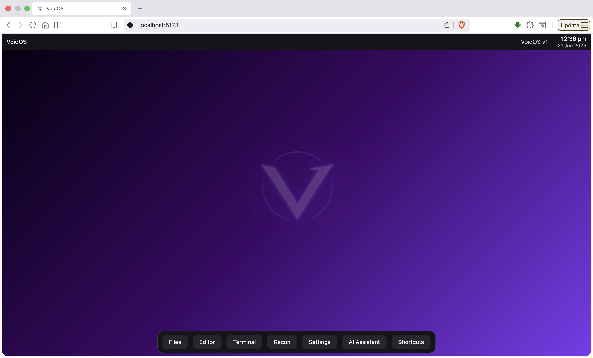
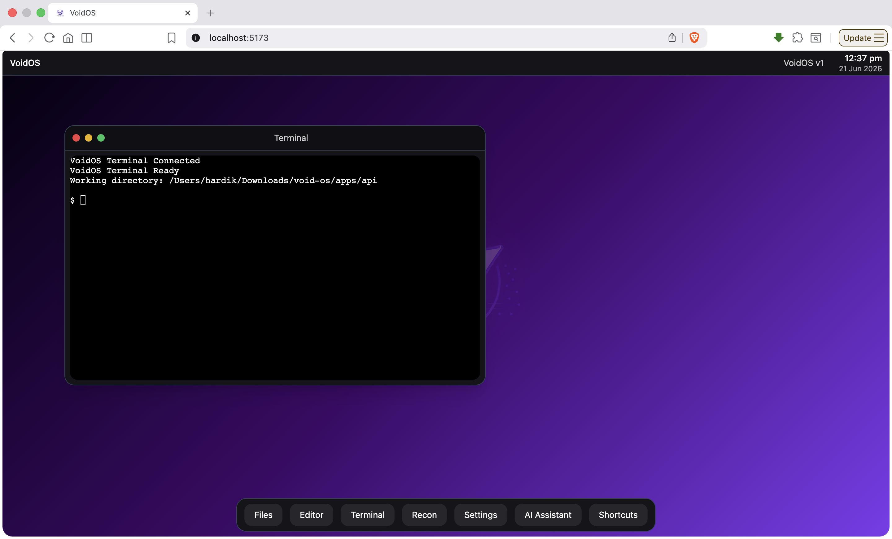
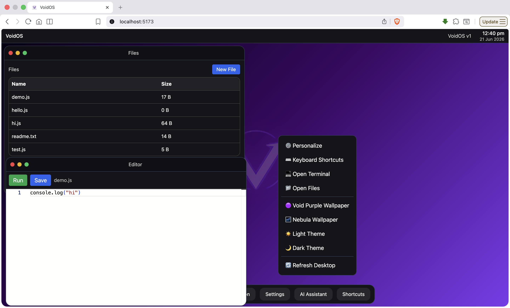
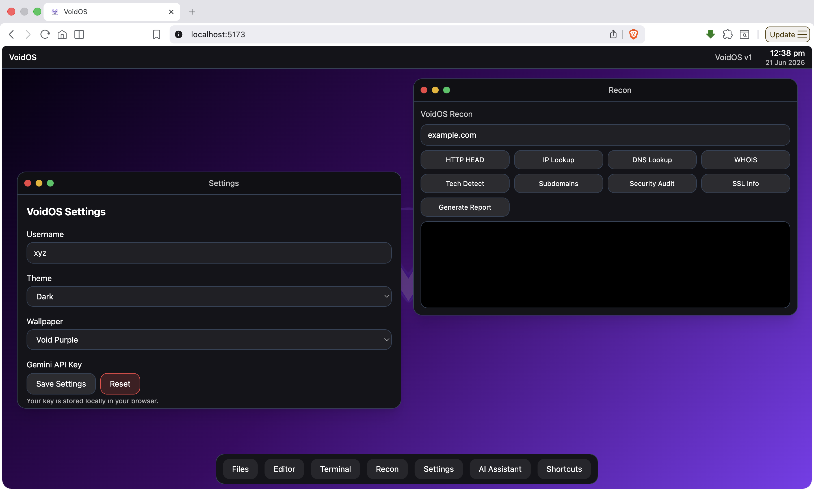

# VoidOS

A browser-based operating system built with React, Vite and Node.js.

VoidOS brings a desktop-like experience to the browser with movable windows, a dock, launcher, terminal, file manager, code editor, themes, wallpapers and recon tools.

## Features

- Window management
- Dock and app launcher
- Terminal powered by xterm.js
- Monaco code editor
- File manager
- Recon toolkit
  - DNS lookup
  - IP lookup
  - WHOIS lookup
  - Subdomain enumeration
  - Security header checks
  - Technology detection
- Theme system
- Wallpaper system
- Keyboard shortcuts
- AI assistant support (Gemini API)

## Tech Stack

### Frontend
- React
- Vite
- Tailwind CSS
- Monaco Editor
- xterm.js

### Backend
- Node.js
- Express
- WebSocket
- node-pty

## Quick Start

### Backend

```bash
cd apps/api
npm install
npm run dev
```

### Frontend

```bash
cd apps/web
npm install
npm run dev
```

### Open

Frontend:

```text
http://localhost:5173
```

Backend:

```text
http://localhost:4000
```

## Docker

```bash
cd infra
docker compose up --build
```

## Keyboard Shortcuts

| Shortcut | Action |
|----------|---------|
| Ctrl/⌘ + Space | Open Launcher |
| Ctrl/⌘ + 1 | Files |
| Ctrl/⌘ + 2 | Editor |
| Ctrl/⌘ + 3 | Terminal |
| Ctrl/⌘ + 4 | Recon |
| Ctrl/⌘ + , | Settings |

## Project Structure

```text
apps/
├── api/
├── web/
└── infra/
```

## Roadmap

- Notifications
- Better AI integration
- Folder support
- Drag and drop files
- Boot screen
- Lock screen

## License

Personal project built for learning, experimentation and development.

## Screenshots

### Desktop



### Terminal



### Files-Editor-Right click



### Settings


